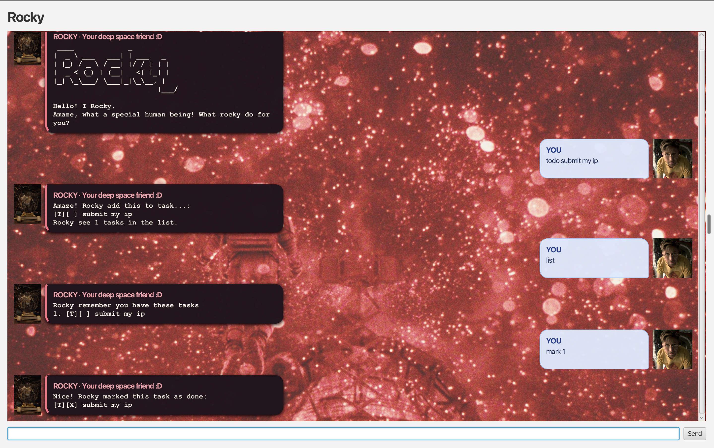

# Rocky User Guide

**Rocky** is a desktop task manager with a conversational interface. Use it to
record to-dos, deadlines, and events; find and sort work; and keep your task
list between sessions.



## Quick start

1. Ensure Java 25 is available.
2. From the project root, run `./gradlew run`.
3. Type a command in the message box and press <kbd>Enter</kbd> or select
   **Send**.

Rocky saves changes automatically in `data/rocky.txt` and loads that file the
next time it starts.

## Features at a glance

Rocky can:

- add to-dos, dated deadlines, and events;
- list every task, find tasks by keyword, and sort tasks by date;
- mark tasks complete or incomplete, and delete tasks; and
- save the task list automatically between sessions.

## Command format

Type command keywords in lowercase as shown below. Words in uppercase are
placeholders that you replace with your own information; do not type the
uppercase placeholder itself.

| Placeholder | Meaning |
| --- | --- |
| `DESCRIPTION` | The text that describes a task, such as `buy shampoo`. |
| `NUMBER` | The one-based number displayed by `list` or `sort`. |
| `KEYWORD` | Text to search for in task descriptions. |
| `DATE_OR_TIME` | A date, optionally followed by a time. |
| `START`, `END` | The event start and end date or date-time. |

### Dates and times

For deadlines and events, use one of these formats:

- `yyyy-MM-dd`, for example `2026-10-15`
- `yyyy-MM-dd HHmm` in 24-hour time, for example `2026-10-15 1800`

For an event, enter the description first, then `/from START`, then `/to END`:

```text
event DESCRIPTION /from START /to END
```

Both event endpoints must use the same format: either both dates or both
date-times. Rocky rejects an event if `/to` comes before `/from` or the date
formats are mixed.

## Commands

### Add a to-do

Format: `todo DESCRIPTION`

Adds a task without a date.

```text
todo buy shampoo
```

### Add a deadline

Format: `deadline DESCRIPTION /by DATE_OR_TIME`

Adds a task due on a date or at a specific time. Enter the description before
the `/by` marker.

```text
deadline submit report /by 2026-10-15
deadline call client /by 2026-10-15 1800
```

### Add an event

Format: `event DESCRIPTION /from START /to END`

Adds an event with a start and end. Enter the description, start, and end in
that order.

```text
event grooming appointment /from 2026-10-15 /to 2026-10-16
event team meeting /from 2026-10-15 1400 /to 2026-10-15 1600
```

### View and find tasks

Formats: `list`, `find KEYWORD`, `sort`

| Command | What it does |
| --- | --- |
| `list` | Shows every task in its current order. |
| `find KEYWORD` | Shows tasks whose descriptions contain the keyword, ignoring case. |
| `sort` | Orders dated tasks from earliest to latest, then places undated to-dos last. The sorted order is saved. |

Examples:

```text
list
find shampoo
sort
```

### Mark, unmark, or delete a task

Formats: `mark NUMBER`, `unmark NUMBER`, `delete NUMBER`

Use the number displayed beside a task to update it.

| Command | What it does |
| --- | --- |
| `mark NUMBER` | Marks a task as complete. |
| `unmark NUMBER` | Marks a task as incomplete. |
| `delete NUMBER` | Permanently removes a task. |

```text
mark 1
unmark 1
delete 2
```

### Exit Rocky

Format: `bye`

Closes Rocky.

```text
bye
```

## Tips

- Rocky confirms each change in the chat. If a command is incomplete or has an
  invalid date, read Rocky's reply for the required format.
- Run `list` after changes when you need task numbers for `mark`, `unmark`, or
  `delete`.
- You can edit or back up `data/rocky.txt`, but use Rocky for normal task
  management so the saved data remains valid.
